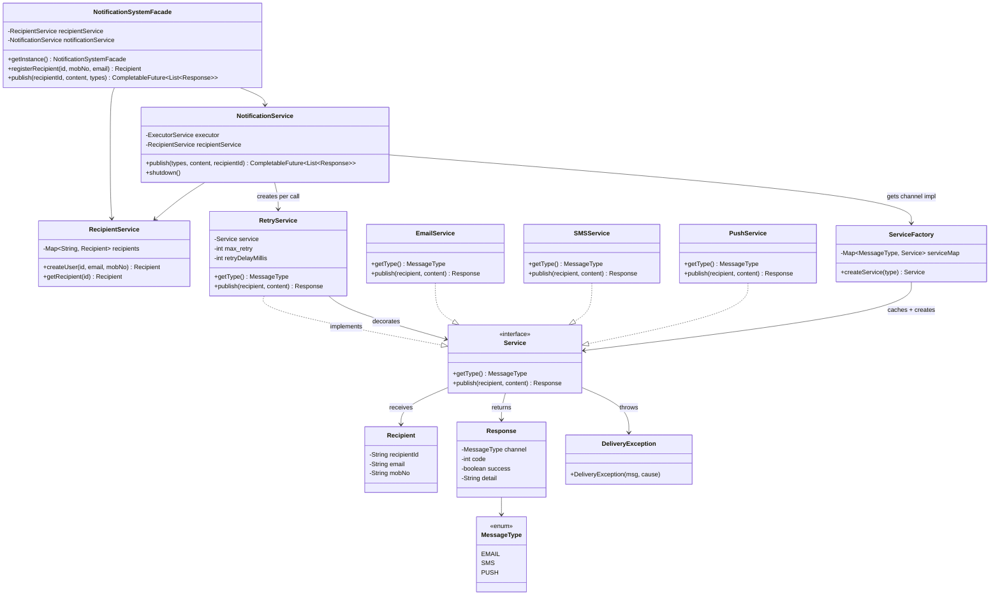

# Notification System — Low-Level Design

## Functional Requirements

1. Supports EMAIL, SMS, and PUSH notification channels
2. Sends notifications asynchronously
3. Can send one or multiple channel types per request
4. Delivery is non-blocking, using a thread pool for parallel sending
5. Failed deliveries are retried with configurable attempts and backoff

## Non-Functional Requirements

1. **Modularity** — well-separated classes with single responsibilities
2. **Extensibility** — new channels added without modifying existing code
3. **OOD** — follows SOLID principles (Strategy, Factory, Decorator patterns)

---

## High-Level Architecture

```
┌──────────────────────────────────────────────────────────────┐
│                  NotificationSystemFacade                     │
│                 (Singleton — DCL + volatile)                  │
├─────────────────────────┬────────────────────────────────────┤
│    RecipientService     │       NotificationService          │
│                         │       (10-thread daemon pool)      │
│    recipients (CHM)     │                                    │
└─────────────────────────┴──────────────┬─────────────────────┘
                                         │
                                         ▼
                                  ┌──────────────┐
                                  │ RetryService  │  (Decorator)
                                  │  max 3 + 1s  │
                                  └──────┬───────┘
                                         │
                              ┌──────────┼──────────┐
                              ▼          ▼          ▼
                        ┌─────────┐ ┌─────────┐ ┌─────────┐
                        │ Email   │ │  SMS    │ │  Push   │
                        │ Service │ │ Service │ │ Service │
                        └─────────┘ └─────────┘ └─────────┘
                              ▲          ▲          ▲
                              └──────────┼──────────┘
                                         │
                                  ServiceFactory
                                  (cached singletons)
```

---

## Class Diagram

