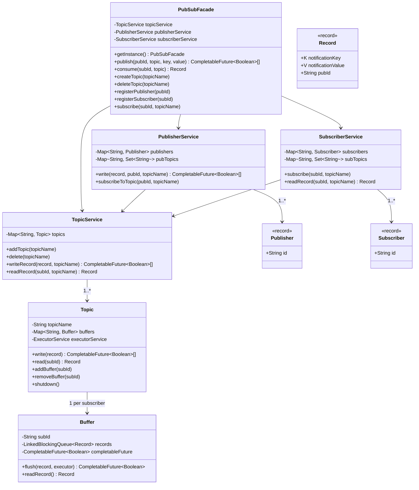

# PubSub System — Low-Level Design

## Functional Requirements

1. Create and delete topics
2. Producers can write messages to a topic
3. Consumers can subscribe/unsubscribe to a topic
4. Messages are broadcast to every subscriber on the topic
5. Message ordering is preserved per subscriber
6. Producers write and consumers read asynchronously

## Non-Functional Requirements

1. **Modularity** — clear separation of concerns, independently testable components
2. **Extensibility** — open to future features (partitions, dead-letter queues, replay)
3. **Scalability** — concurrent-safe without global locks, non-blocking write path

---

## High-Level Architecture

```
┌──────────────────────────────────────────────────────────┐
│                      PubSubFacade                        │
│                  (Singleton — DCL + volatile)             │
├──────────────────┬──────────────────┬────────────────────┤
│  PublisherService│   TopicService   │ SubscriberService  │
│                  │                  │                    │
│  publishers      │   topics         │  subscribers       │
│  pubTopics       │                  │  subTopics         │
└────────┬─────────┴────────┬─────────┴──────────┬─────────┘
         │                  │                    │
         └──────────────────┼────────────────────┘
                            ▼
                    ┌──────────────┐
                    │    Topic     │
                    │              │
                    │  buffers     │
                    │  executor    │
                    │              │
                    │ ┌──────────┐ │
                    │ │ Buffer   │ │  × N subscribers
                    │ │ (LBQ +CF)│ │
                    │ └──────────┘ │
                    └──────────────┘
```

---

## Class Diagram

